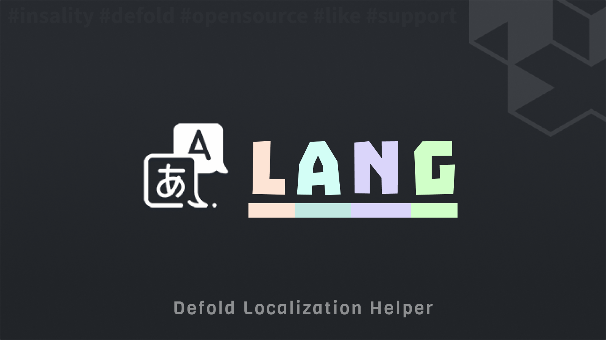

[](https://github.com/Insality/defold-lang/tags)
[](https://github.com/Insality/defold-lang/actions)
[](https://codecov.io/gh/Insality/defold-lang)

[](https://github.com/sponsors/insality) [](https://ko-fi.com/insality) [](https://www.buymeacoffee.com/insality)


# Lang

**Lang** - is a module for working with localization in **Defold**. It provides a way to load and use different languages files in your project.

## Features

- **Handy API** - Simple and easy to use API
- **Text Support** - Load and use different JSON languages files
- **Saver Support** - Save current selected language in [Defold-Saver](https://github.com/Insality/defold-saver)
- **Druid Support** - Easy [Druid](https://github.com/Insality/druid) integration

## Setup

### [Dependency](https://www.defold.com/manuals/libraries/)

Open your `game.project` file and add the following line to the dependencies field under the project section:

**[Lang](https://github.com/Insality/defold-lang/archive/refs/tags/2.zip)**

```
https://github.com/Insality/defold-lang/archive/refs/tags/2.zip
```

After that, select `Project ▸ Fetch Libraries` to update [library dependencies]((https://defold.com/manuals/libraries/#setting-up-library-dependencies)). This happens automatically whenever you open a project so you will only need to do this if the dependencies change without re-opening the project.

### Library Size

> **Note:** The library size is calculated based on the build report per platform

| Platform         | Library Size |
| ---------------- | ------------ |
| HTML5            | **1.80 KB**  |
| Desktop / Mobile | **2.82 KB**  |


### Configuration

You should configure the **Lang** module in the `game.project` file:

```ini
[lang]
path = /resources/lang
langs = en,ru,es
default = en
```

This configuration section for `game.project` defines various settings:

- **path**: The path to the directory with language files. Default is `/resources/lang`. The module will search for language files in this directory by the language name.
- **langs**: A list of available languages. Default is `en`.
- **default**: The default language. Default is `en`.

The module uses `sys.load_resource` to load the files. Place your files inside your [custom resources folder](https://defold.com/manuals/project-settings/#custom-resources) to ensure they are included in the build.


### Default Language

The default language in settings is used as a fallback. By default, **Defold Lang** tries to load the user device language, acquired by `sys.get_sys_info().device_language`. If the language is not found in the available languages, the default language is used. Defold uses the two-character [ISO-639 format](https://en.wikipedia.org/wiki/List_of_ISO_639_language_codes) for language codes ("en", "ru", "es", etc).


### Localization Files

Create a directory with language files in the `path` directory. The module will search for language files in this directory by the language name.

The lang file - is a JSON file with the simple key-value structure. The key is the language id, and the value is the text for this language id.

Example of the lang file:

```js
{
	"ui_hello_world": "Hello, World!",
	"ui_hello_name", "Hello, %s!"
	"ui_settings": "Settings",
	"ui_exit": "Exit"
}
```


## API Reference

### Quick API Reference

```lua
lang.init()
lang.set_lang(lang_id)
lang.get_lang()
lang.get_langs()
lang.set_next_lang()
lang.get_next_lang()
lang.txt(text_id)
lang.txp(text_id, ...)
lang.txr(text_id)
lang.is_exist(text_id)
lang.set_logger([logger])
lang.reset_state()
```

### API Reference

Read the [API Reference](API_REFERENCE.md) file to see the full API documentation for the module.


## Use Cases

Read the [Use Cases](USE_CASES.md) file to see several examples of how to use the this module in your Defold game development projects.


## FAQ

Read the [FAQ](FAQ.md) file to see the answers to frequently asked questions about the module.


## License

This project is licensed under the MIT License - see the [LICENSE](LICENSE) file for details.


## Issues and Suggestions

For any issues, questions, or suggestions, please [create an issue](https://github.com/Insality/defold-lang/issues).


## 👏 Contributors

<a href="https://github.com/Insality/defold-lang/graphs/contributors">
  
</a>

## Changelog

<details>

### **V1**
	- Initial release

### **V2**
	- Add Defold Editor Script to collect unique characters from selected JSON files

### **V3**
	- Add `lang.get_next_lang()` function
	- Better error messages

</details>


## ❤️ Support project ❤️

Your donation helps me stay engaged in creating valuable projects for **Defold**. If you appreciate what I'm doing, please consider supporting me!

[](https://github.com/sponsors/insality) [](https://ko-fi.com/insality) [](https://www.buymeacoffee.com/insality)
