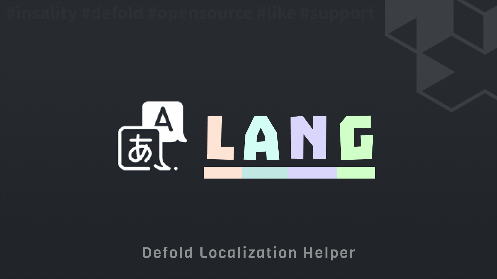

[](https://github.com/Insality/defold-lang/tags)
[](https://github.com/Insality/defold-lang/actions)
[](https://codecov.io/gh/Insality/defold-lang)

[](https://github.com/sponsors/insality) [](https://ko-fi.com/insality) [](https://www.buymeacoffee.com/insality)


# Defold Lang

**Defold Lang** is a simple localization module for **Defold**. It loads language files and gives you a small API to read and switch translations.

## Features

- **Handy API** - Simple and easy to use API
- **Multiple File Formats** - JSON, Lua, and CSV
- **Runtime Locale Packs** - Load additional translations with `lang.load_langs()`
- **Async Loading** - Custom loader functions for bundle resources, HTTP, and other I/O
- **Saver Support** - Save current selected language in [Defold-Saver](https://github.com/Insality/defold-saver)
- **Druid Support** - Easy [Druid](https://github.com/Insality/druid) integration

## Setup

Open your `game.project` file and add the dependency:

**[Lang](https://github.com/Insality/defold-lang/archive/refs/tags/5.zip)**

```
https://github.com/Insality/defold-lang/archive/refs/tags/5.zip
```

After that, select `Project ▸ Fetch Libraries` to update [library dependencies](https://defold.com/manuals/libraries/#setting-up-library-dependencies). This happens automatically whenever you open a project so you will only need to do this if the dependencies change without re-opening the project.


## Quick Start

### 1. Prepare translation files

Put files inside your [custom resources folder](https://defold.com/manuals/project-settings/#custom-resources) so they are included in the build. Keys are the same across all languages, values are the translated text.

**JSON** — one file per language. Easy to load separately over the network, which is handy for runtime locale packs and downloaded content.

```json
{
	"ui_hello_world": "Hello, World!",
	"ui_hello_name": "Hello, %s!",
	"ui_settings": "Settings",
	"ui_exit": "Exit"
}
```

**CSV** — all languages in a single file. Convenient while developing: edit every translation in one place, compare columns side by side.

```csv
key,en,fr,ko
ui_hello_world,"Hello, World!","Bonjour, le monde!","안녕하세요, 세계!"
ui_hello_name,"Hello, %s!","Bonjour, %s!","안녕하세요, %s!"
```

Point each language at the same CSV file — the `id` selects the column:

```lua
lang.init({
	{ id = "en", path = "/resources/lang/translations.csv" },
	{ id = "fr", path = "/resources/lang/translations.csv" },
	{ id = "ko", path = "/resources/lang/translations.csv" },
})
```

**Lua** — one file per language, passed via `require()`. Loads instantly since the table is already in memory. Can be convenient if you prefer keeping translations as Lua modules.

```lua
-- resources/lang/en.lua
return {
	ui_hello_world = "Hello, World!",
	ui_hello_name = "Hello, %s!",
}
```

```lua
lang.init({
	{ id = "en", path = require("resources.lang.en") },
	{ id = "fr", path = require("resources.lang.fr") },
	{ id = "ko", path = require("resources.lang.ko") },
})
```

You can mix formats in one config if needed.


### 2. Load languages

Call `lang.init()` once at startup with a list of available languages:

```lua
local lang = require("lang.lang")

lang.init({
	{ id = "en", path = "/resources/lang/en.json" },
	{ id = "fr", path = "/resources/lang/fr.json" },
	{ id = "ko", path = "/resources/lang/ko.json" },
})
```

The module picks the language automatically:

1. **Force parameter** — second argument to `lang.init()`, if provided
2. **Saved language** — from `lang.state.lang` (via [Defold-Saver](https://github.com/Insality/defold-saver) or your save system)
3. **System language** — device language from `sys.get_sys_info().language`
4. **Default** — first language in the list

Use two-character [ISO-639 codes](https://en.wikipedia.org/wiki/List_of_ISO_639_language_codes) (`"en"`, `"fr"`, `"ko"`, etc).

To force a language on start:

```lua
lang.init({
	{ id = "en", path = "/resources/lang/en.json" },
	{ id = "fr", path = "/resources/lang/fr.json" },
}, "fr")
```


### 3. Use translations

```lua
-- Plain text
print(lang.txt("ui_hello_world"))        -- "Hello, World!"

-- Text with parameters (%s in the translation)
print(lang.txp("ui_hello_name", "John")) -- "Hello, John!"

-- Refresh UI when language changes
lang.on_lang_changed = function()
	druid.on_language_change()
end

-- Switch language
lang.set_lang("fr")
lang.set_next_lang()
```

Per-call callbacks in `set_lang`, `set_next_lang`, and `load_langs` still work — they run before `lang.on_lang_changed`.


### 4. Add translations at runtime

Use `lang.load_langs()` to load extra locale packs — DLC, platform bundles, downloaded content. Translations from a pack are merged into the current language. If the same key exists in multiple packs, the last loaded pack wins. Calling `lang.init()` clears all previously loaded packs.

```lua
-- Base languages at startup
lang.init({
	{ id = "en", path = "/resources/lang/en.json" },
})

-- Load DLC translations
lang.load_langs("dlc_1", {
	{ id = "en", path = "/bundle/lang/dlc_en.json" },
	{ id = "fr", path = "/bundle/lang/dlc_fr.json" },
	{ id = "ko", path = "/bundle/lang/dlc_ko.json" },
}, function()
	druid.on_language_change()
end)

-- Add a new language from a pack
lang.load_langs("content_ko", {
	{ id = "ko", path = "/resources/lang/ko.json" },
})
lang.set_lang("ko")
```


### 5. Custom loader

By default, files are loaded from [custom resources](https://defold.com/manuals/project-settings/#custom-resources) synchronously. If your translations live elsewhere — bundle folder, HTTP, platform-specific paths — pass a `loader` function in the language config:

The loader runs when the language is loaded. Loading is async, so use the callback in `lang.set_lang()` or `lang.load_langs()` to know when translations are ready:

```lua

local function load_from_bundle(path, on_success, on_error)
	local full_path = sys.get_application_path() .. path
	local f = io.open(full_path, "rb")
	if f then
		on_success(f:read("*a"))
		f:close()
	else
		on_error("File not found: " .. full_path)
	end
end

lang.init({
	{ id = "en", path = "/bundle/lang/en.json", loader = load_from_bundle },
	{ id = "fr", path = "/bundle/lang/fr.json", loader = load_from_bundle },
	{ id = "ko", path = "/bundle/lang/ko.json", loader = load_from_bundle },
})

lang.set_lang("en", function()
	print(lang.txt("ui_hello_world"))
	druid.on_language_change()
end)
```

Works the same with `lang.load_langs()` — pass `loader` in any entry inside the pack.


## API Reference

### Quick API Reference

```lua
-- Data management
lang.init(available_langs, [lang_on_start])
lang.load_langs(pack_id, langs, [on_lang_changed])
lang.set_lang(lang_id, [on_lang_changed])
lang.set_next_lang([on_lang_changed])
lang.get_next_lang()
lang.get_lang()
lang.get_langs()

-- Get translations
lang.txt(text_id)
lang.txp(text_id, ...)
lang.txr(text_id)
lang.is_exist(text_id)

-- Callback
lang.on_lang_changed

-- System
lang.set_logger([logger])
lang.reset_state()
lang.get_state()
lang.set_state(state)
lang.get_default_lang()
lang.get_lang_table()
lang.is_lang_available(lang_id)
```

#### Basic Usage Example

```lua
local lang = require("lang.lang")

-- Initialize with language files
lang.init({
	{ id = "en", path = "/resources/lang/en.json" },
	{ id = "fr", path = "/resources/lang/fr.json" },
	{ id = "ko", path = "/resources/lang/ko.json" },
})

-- Use translations
print(lang.txt("ui_hello_world"))        -- "Hello, World!"
print(lang.txp("ui_hello_name", "John"))   -- "Hello, John!"

-- Change language
lang.set_lang("ko")
print(lang.txt("ui_hello_world"))        -- "안녕하세요, 세계!"
```

### API Reference

Read the [API Reference](API_REFERENCE.md) file to see the full API documentation for the module.


## Use Cases

Read the [Use Cases](USE_CASES.md) file to see several examples of how to use the this module in your Defold game development projects.


## License

This project is licensed under the MIT License - see the [LICENSE](LICENSE) file for details.


## Issues and Suggestions

For any issues, questions, or suggestions, please [create an issue](https://github.com/Insality/defold-lang/issues).


## 👏 Contributors

<a href="https://github.com/Insality/defold-lang/graphs/contributors">
  
</a>

## Changelog

<details>

### **V1**
	- Initial release

### **V2**
	- Add Defold Editor Script to collect unique characters from selected JSON files

### **V3**
	- Add `lang.get_next_lang()` function
	- Better error messages

### **V4**
	- [Breaking] Lang now use `lang.init()` function to initialize module instead of `game.project` configuration
	- Add Lua file support
	- Add CSV file support
	- Updated editor script to collect unique characters from selected JSON and CSV files
	- Add Lang debug properties page for Druid properties panel

### **V5**
	- [Breaking] Removed `lang.set_lang_table()` function
	- [Breaking] Removed `lang.render_properties_panel()` function
	- [Breaking] `lang.set_lang()` no longer returns boolean, now accepts optional `on_lang_changed` callback
	- Add `lang.load_langs()` for loading additional locale packs at runtime
	- Add async loading support via custom `loader` function in language config
	- Internal refactor: moved internal modules to `lang/internal/` subfolder
	- Updated logger

</details>


## ❤️ Support project ❤️

Your donation helps me stay engaged in creating valuable projects for **Defold**. If you appreciate what I'm doing, please consider supporting me!

[](https://github.com/sponsors/insality) [](https://ko-fi.com/insality) [](https://www.buymeacoffee.com/insality)
